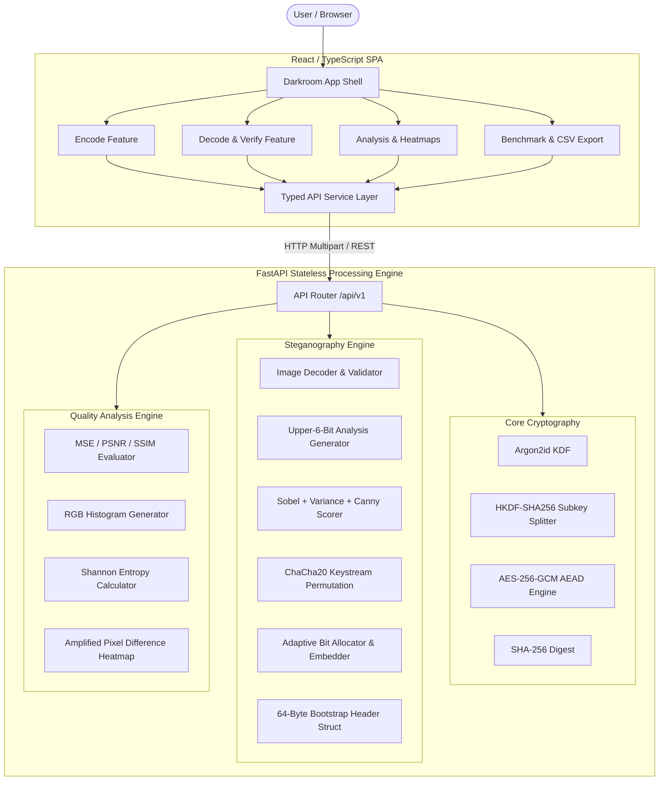
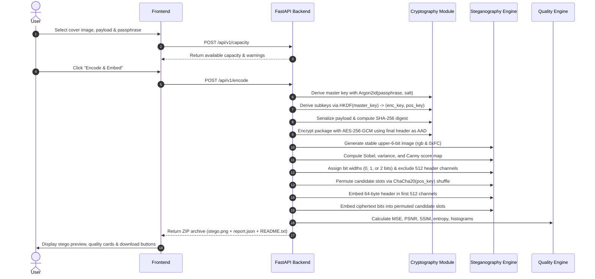
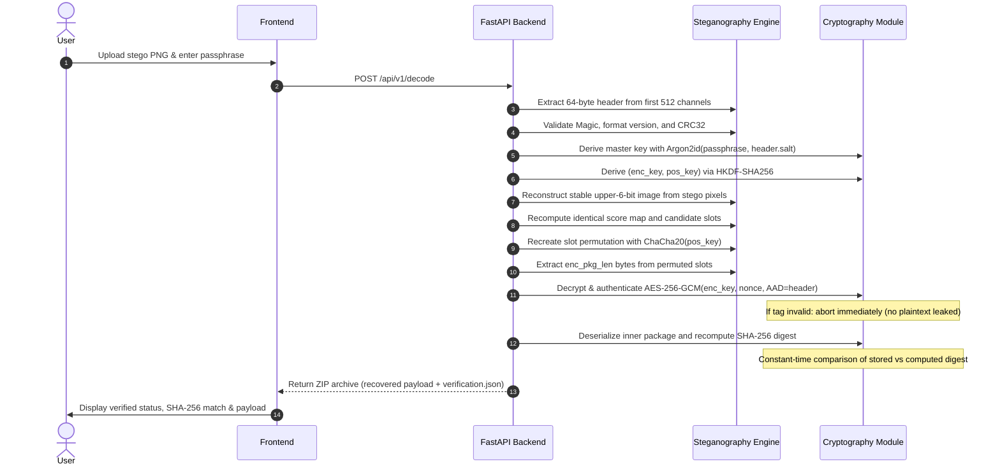

# System Architecture

## Architecture Overview

The system follows a decoupled, stateless client-server architecture:

```mermaid
graph TD
    User([User / Browser])
    
    subgraph Frontend [React / TypeScript SPA]
        Shell[Darkroom App Shell]
        EncPage[Encode Feature]
        DecPage[Decode & Verify Feature]
        AnaPage[Analysis & Heatmaps]
        BenchPage[Benchmark & CSV Export]
        APIService[Typed API Service Layer]
    end
    
    subgraph Backend [FastAPI Stateless Processing Engine]
        API[API Router /api/v1]
        
        subgraph CoreCrypto [Core Cryptography]
            Argon2[Argon2id KDF]
            HKDFModule[HKDF-SHA256 Subkey Splitter]
            AESGCM[AES-256-GCM AEAD Engine]
            SHA[SHA-256 Digest]
        end
        
        subgraph StegoEngine [Steganography Engine]
            ImgIO[Image Decoder & Validator]
            StableMap[Upper-6-Bit Analysis Generator]
            FeatureMap[Sobel + Variance + Canny Scorer]
            Permute[ChaCha20 Keystream Permutation]
            Embedder[Adaptive Bit Allocator & Embedder]
            HeaderMgr[64-Byte Bootstrap Header Struct]
        end
        
        subgraph QualityEngine [Quality Analysis Engine]
            Metrics[MSE / PSNR / SSIM Evaluator]
            Hist[RGB Histogram Generator]
            Entropy[Shannon Entropy Calculator]
            Heatmap[Amplified Pixel Difference Heatmap]
        end
    end
    
    User --> Shell
    Shell --> EncPage & DecPage & AnaPage & BenchPage
    EncPage & DecPage & AnaPage & BenchPage --> APIService
    APIService -->|HTTP Multipart / REST| API
    
    API --> CoreCrypto
    API --> StegoEngine
    API --> QualityEngine
```

## Encoding Pipeline Flow

```mermaid
sequenceDiagram
    autonumber
    actor User
    participant Frontend
    participant API as FastAPI Backend
    participant Crypto as Cryptography Module
    participant Stego as Steganography Engine
    participant Analysis as Quality Engine

    User->>Frontend: Select cover image, payload & passphrase
    Frontend->>API: POST /api/v1/capacity
    API-->>Frontend: Return available capacity & warnings
    User->>Frontend: Click "Encode & Embed"
    Frontend->>API: POST /api/v1/encode
    API->>Crypto: Derive master key with Argon2id(passphrase, salt)
    API->>Crypto: Derive subkeys via HKDF(master_key) -> (enc_key, pos_key)
    API->>Crypto: Serialize payload & compute SHA-256 digest
    API->>Crypto: Encrypt package with AES-256-GCM using final header as AAD
    API->>Stego: Generate stable upper-6-bit image (rgb & 0xFC)
    API->>Stego: Compute Sobel, variance, and Canny score map
    API->>Stego: Assign bit widths (0, 1, or 2 bits) & exclude 512 header channels
    API->>Stego: Permute candidate slots via ChaCha20(pos_key) shuffle
    API->>Stego: Embed 64-byte header in first 512 channels
    API->>Stego: Embed ciphertext bits into permuted candidate slots
    API->>Analysis: Calculate MSE, PSNR, SSIM, entropy, histograms
    API-->>Frontend: Return ZIP archive (stego.png + report.json + README.txt)
    Frontend->>User: Display stego preview, quality cards & download buttons
```

## Extraction & Verification Flow

```mermaid
sequenceDiagram
    autonumber
    actor User
    participant Frontend
    participant API as FastAPI Backend
    participant Stego as Steganography Engine
    participant Crypto as Cryptography Module

    User->>Frontend: Upload stego PNG & enter passphrase
    Frontend->>API: POST /api/v1/decode
    API->>Stego: Extract 64-byte header from first 512 channels
    API->>Stego: Validate Magic, format version, and CRC32
    API->>Crypto: Derive master key with Argon2id(passphrase, header.salt)
    API->>Crypto: Derive (enc_key, pos_key) via HKDF-SHA256
    API->>Stego: Reconstruct stable upper-6-bit image from stego pixels
    API->>Stego: Recompute identical score map and candidate slots
    API->>Stego: Recreate slot permutation with ChaCha20(pos_key)
    API->>Stego: Extract enc_pkg_len bytes from permuted slots
    API->>Crypto: Decrypt & authenticate AES-256-GCM(enc_key, nonce, AAD=header)
    Note over Crypto: If tag invalid: abort immediately (no plaintext leaked)
    API->>Crypto: Deserialize inner package and recompute SHA-256 digest
    Note over Crypto: Constant-time comparison of stored vs computed digest
    API-->>Frontend: Return ZIP archive (recovered payload + verification.json)
    Frontend->>User: Display verified status, SHA-256 match & payload
```
